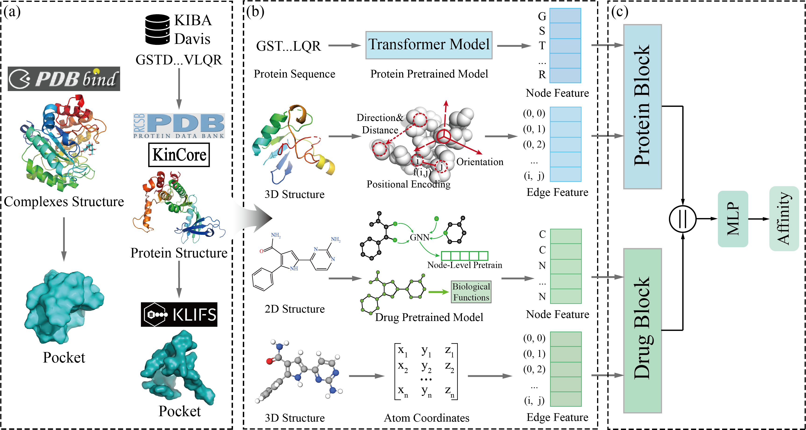

# PocketDTA



## Dependencies
```
torch==2.3.1
torch_geometric==2.6.1
pandas==2.2.3
transformers==4.46.3
tqdm==4.67.1
scikit-learn==1.5.2
urllib3==2.2.3
Bio==1.6.2
torch_cluster==1.6.3+pt23cu121
nump ==1.24.3
rdkit==2024.3.6
```
## Data
We provide raw protein structure data, as well as data that has been segmented. In addition, we also provide data that has been processed.You can download them using the links below:
```
https://zenodo.org/records/14286374
```
## Pre-trained model
1. Protein pre-trained model
you can download these pLMs from [ProtTrans](https://github.com/agemagician/ProtTrans) and put models in Rostlab directory.
Our code shows the usage of these pLMs, or alternatively, you can access additional usage examples of pLM embeddings from ProtTrans.
2. Drug pre-trained model
you can download [Drug pre-trained model](https://github.com/snap-stanford/pretrain-gnns/) and put models in ligand_pretrain_models directory.
## Train
```
python train.py
```
If processed data is used, the code will directly load and train on it. Conversely, if raw data is used, it must first be processed before training.

After training, the model parameters are saved in the model directory.
## Test
```
python test.py
```
The test.py requires the input of the model parameters' path and the selection of the test dataset.
